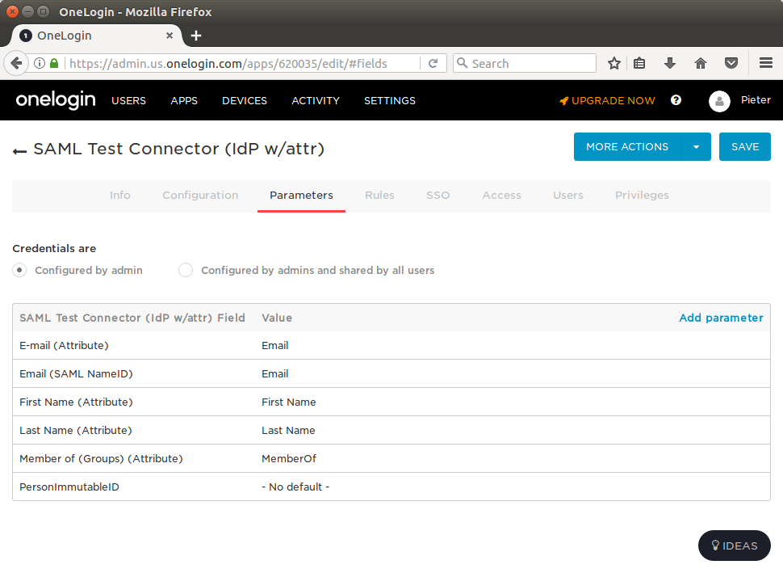
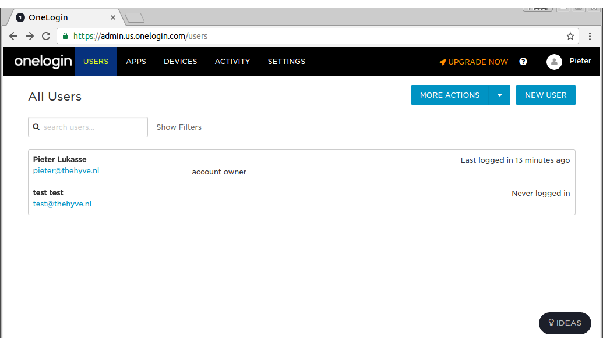
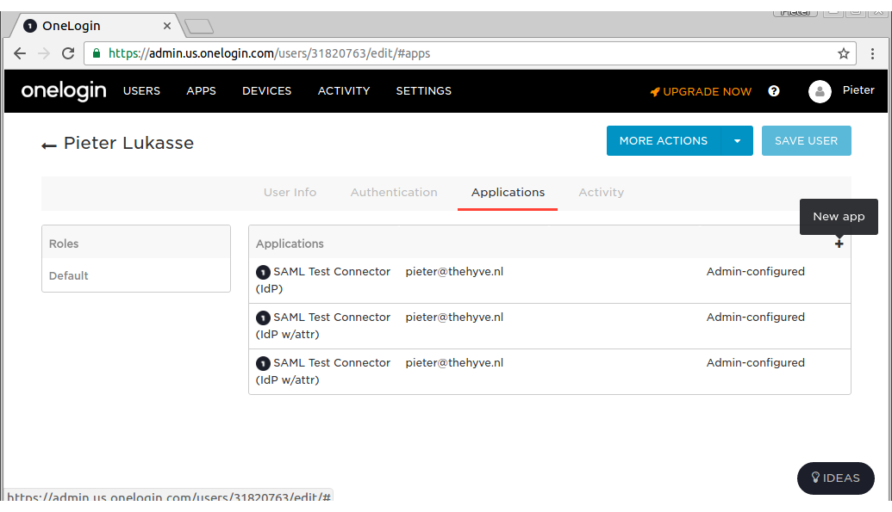
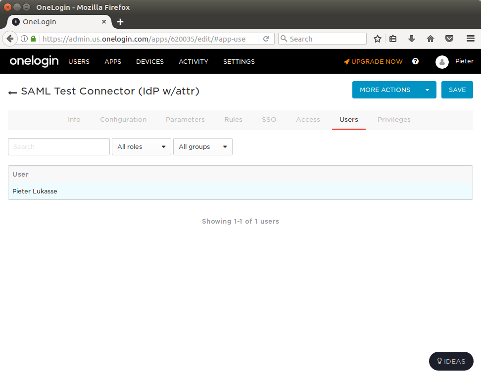

# Introduction

The cBioPortal includes support for SAML (Security Assertion Markup Language).  This document explains why you might find SAML useful, and how to configure SAML within your own instance of cBioPortal.

Please note that configuring your local instance to support SAML requires many steps.  This includes configuration changes and a small amount of debugging.  If you follow the steps below, you should be up and running relatively quickly, but be forewarned that you may have do a few trial runs to get everything working.

In the documentation below, we also provide details on how to perform SAML authentication via a commercial company:  [OneLogin](https://www.onelogin.com/).  OneLogin provides a free tier for testing out SAML authentication, and is one of the easier options to get a complete SAML workflow set-up.  Once you have OneLogin working, you should then have enough information to transition to your final authentication service.

## What is SAML?

SAML is an open standard that enables one to more easily add an authentication service on top of any existing web application.  For the full definition, see the [SAML Wikipedia entry](http://en.wikipedia.org/wiki/Security_Assertion_Markup_Language).

In its simplest terms, SAML boils down to four terms:

* **identity provider**:  this is a web-based service that stores user names and passwords, and provides a login form for users to authenticate.  Ideally, it also provides easy methods to add / edit / delete users, and also provides methods for users to reset their password.  In the documentation below, OneLogin.com serves as the identity provider.

* **service provider**:  any web site or web application that provides a service, but should only be available to authenticated and authorized users.  In the documentation below, the cBioPortal is the service provider.

* **authentication**:  a means of verifying that a user is who they purport to be.  Authentication is performed by the identify provider, by extracting the user name and password provided in a login form, and matching this with information stored in a database.

* **authorization**:  defines resources a user can access.  When authorization is turned on with cBioPortal, users can only access cancer studies they are specifically authorized to view (or PUBLIC studies, [if the server has been configured to contain these](User-Authorization.md#configuring-public-studies)).  This enables one to store multiple cancer studies within a single instance of cBioPortal, but provide fine-grained control over which users can access which studies.  Authorization is implemented within the core cBioPortal code, and not the identify provider.

## Why is SAML Relevant to cBioPortal?

The cBioPortal code has no means of storing user name and passwords and no means of directly authenticating users.  If you want to restrict access to your instance of cBioPortal, you therefore have to consider an external authentication service.  SAML is one means of doing so, and your larger institution may already provide SAML support.  For example, at Sloan Kettering and Dana-Farber, users of the internal cBioPortal instances login with their regular credentials via SAML.  This greatly simplifies user management.

# Setting up an Identity Provider

As noted above, we provide details on how to perform SAML authentication via a commercial company:  [OneLogin](https://www.onelogin.com/).  
If you already have an IDP set up, you can skip this part and go to [Configuring SAML within cBioPortal](#configuring-saml-within-cbioportal).

OneLogin provides a free tier for testing out SAML authentication, and is one of the easier options to get a complete SAML workflow set-up.  Once you have OneLogin working, you should then have enough information to transition to your final authentication service.  As you follow the steps below, the following link may be helpful: [How to Use the OneLogin SAML Test Connector](https://support.onelogin.com/hc/en-us/articles/202673944-How-to-Use-the-OneLogin-SAML-Test-Connector).

To get started:

* [Register a new OneLogin.com Account](https://www.onelogin.com/signup?ref=floating-sidebar)

## Setting up a SAML Test Connector

* [Login to OneLogin.com](https://app.onelogin.com/login).
* Under Apps, Select Add Apps.
* Search for SAML.
* Select the option labeled: OneLogin SAML Test (IdP w/attr).
* "SAVE" the app, then select the Configuration Tab.

* Under the Configuration Tab for OneLogin SAML Test (IdP w/attr), paste the following fields (this is assuming you are testing everything via localhost).

    * Audience: cbioportal
    * Recipient: http://localhost:8080/cbioportal/saml/SSO
    * ACS (Consumer) URL Validator*:  ^http:\/\/localhost\:8080\/cbioportal\/saml\/SSO$
    * ACS (Consumer) URL*:  http://localhost:8080/cbioportal/saml/SSO


* Add at least the parameters: 
    * Email (Attribute)
    * Email (SAML NameID)



* Find your user in the "Users" menu



* Link the SAML app to your user (click "New app" on the **+** icon found on the top right of the "Applications" table to do this - see screenshot below): 



* Configure these **email** parameters in the Users menu:


 


## Downloading the SAML Test Connector Meta Data

* Go to the SSO Tab within OneLogin SAML Test (IdP), find the field labeled:  Issuer URL.  Copy this URL and download it's contents.  This is an XML file that describes the identity provider.


then, move this XML file to:

    portal/src/main/resources/

You should now be all set with OneLogin.com.  Next, you need to configure your instance of cBioPortal.

# Configuring SAML within cBioPortal

## Creating a KeyStore

In order to use SAML, you must create a [Java Keystore](http://docs.oracle.com/javase/7/docs/api/java/security/KeyStore.html).  

This can be done via the Java `keytool` command, which is bundled with Java.

Type the following:

    keytool -genkey -alias secure-key -keyalg RSA -keystore samlKeystore.jks

This will create a Java keystore for a key called:  `secure-key` and place the keystore in a file named `samlKeystore.jks`.  You will be prompted for:

* keystore password (required, for example:  apollo1)
* your name, organization and location (optional)
* key password for `secure-key` (required, for example apollo2)

When you are done, copy `samlKeystore.jsk` to the correct location:
    
    mv samlKeystore.jks portal/src/main/resources/

If you need to export the public certificate associated within your keystore, run:

    keytool -export -keystore samlKeystore.jks -alias secure-key -file cBioPortal.cer

## Modifying portal.properties

Within portal.properties, make sure that:

    app.name=cbioportal

Then, modify the section labeled `authentication`. See SAML parameters shown in example below:

    # authentication
    authenticate=saml
    authorization=true
    saml.sp.metadata.entityid=cbioportal
    saml.idp.metadata.location=classpath:/onelogin_metadata_620035.xml
    saml.idp.metadata.entityid=https://app.onelogin.com/saml/metadata/620035
    saml.keystore.location=classpath:/samlKeystore.jks
    saml.keystore.password=apollo1
    saml.keystore.private-key.key=secure-key
    saml.keystore.private-key.password=apollo2
    saml.keystore.default-key=secure-key
    saml.idp.comm.binding.settings=defaultBinding
    saml.idp.comm.binding.type=
    saml.idp.metadata.attribute.email=User.email
    saml.custom.userservice.class=org.mskcc.cbio.portal.authentication.saml.SAMLUserDetailsServiceImpl
    # global logout (as opposed to local logout):
    saml.logout.local=false
    saml.logout.url=/

Please note that you will have to modify all the above to match your own settings. `saml.idp.comm.binding.type` can be left empty if `saml.idp.comm.binding.settings=defaultBinding`. The `saml.logout.*` settings above reflect the settings of an IDP that supports Single Logout (hopefully the default in most cases - more details in section below).

### Custom scenarios

:information_source: Some settings may need to be adjusted to non-default values, depending on your IDP. For example, if your 
IDP required HTTP-GET requests instead of HTTP-POST, you need to set these properties as such:
 
    saml.idp.comm.binding.settings=specificBinding
    saml.idp.comm.binding.type=bindings:HTTP-Redirect

If you need a very different parsing of the SAML tokens than what is done at `org.mskcc.cbio.portal.authentication.saml.SAMLUserDetailsServiceImpl`, you can point the `saml.custom.userservice.class` to your own implementation: 

    saml.custom.userservice.class=<your_package.your_class_name>

:warning: The property `saml.idp.metadata.attribute.email` can also vary per IDP. It is important to set this correctly since this is a required field by the cBioPortal SAML parser (that is, if `org.mskcc.cbio.portal.authentication.saml.SAMLUserDetailsServiceImpl` is chosen for property `saml.custom.userservice.class`). 

:warning: Some IDPs like to provide their own logout page (e.g. when they don't support the custom SAML Single Logout protocol). For this you can adjust the  
`saml.logout.url` property to a custom URL provided by the IDP. Also set the `saml.logout.local=true` property in this case to indicate that global logout (or Single Logout) is not supported by IDP:

    # local logout followed by a redirect to a global logout page:
    saml.logout.local=true
    saml.logout.url=<idp specific logout URL, e.g. https://idp.logoutpage.com >
    

## More customizations

If your IDP does not have the flexibility of sending the specific credential fields expected by our 
default "user details parsers" implementation (i.e. `core/src/main/java/org/mskcc/cbio/portal/authentication/saml/SAMLUserDetailsServiceImpl.java` 
expects field `mail` to be present in the SAML credential), then please let us know via a [new 
issue at our issue tracking system](https://github.com/cBioPortal/cbioportal/issues/new), so we can 
evaluate whether this is a scenario we would like to support in the default code. You can also consider 
adding your own version of the `SAMLUserDetailsService` class. The class [MSKCCPortalUserDetailsService.java](https://github.com/cBioPortal/cbioportal/blob/master/core/src/main/java/org/mskcc/cbio/portal/authentication/saml/MSKCCPortalUserDetailsService.java) is an 
example of this.


## Authorizing Users

Next, please read the Wiki page on [User Authorization](User-Authorization.md), and add user rights for a single user.


## Configuring the Login.jsp Page (not applicable to most external IDPs)

The login page is configurable via the `portal.properties` properties `skin.authorization_message` and `skin.login.saml.registration_htm`. 
For example in `skin.authorization_message` you can be set to something like this:

```
skin.authorization_message= Welcome to this portal. Access to this portal is available to authorized test users at YOUR ORG.  [<a href="http://thehyve.nl/">Request Access</a>].
```

and `skin.login.saml.registration_htm` can be set to:

```
skin.login.saml.registration_htm=Sign in via XXXX
```

You can also set a standard text in `skin.login.contact_html` that will appear in case of problems: 

```
skin.login.contact_html=If you think you have received this message in error, please contact us at <a style="color:#FF0000" href="mailto:cbioportal-access@your.org">cbioportal-access@your.org</a>
```


## Doing a Test Run

You are now ready to go.

Rebuild the WAR file and re-deploy:

```
mvn -DskipTests clean install
cp portal/target/cbioportal.war $CATALINA_HOME/webapps/
```

Then, go to:  [http://localhost:8080/cbioportal/](http://localhost:8080/cbioportal/).

If all goes well, the following should happen:

* You will be redirected to the OneLogin Login Page.
* After authenticating, you will be redirected back to your local instance of cBioPortal.

If this does not happen, see the Troubleshooting Tips  below.

## Troubleshooting Tips 

### Logging

Getting this to work requires many steps, and can be a bit tricky.  If you get stuck or get an obscure error message, your best bet is to turn on all DEBUG logging.  This can be done via `src/main/resources/log4j.properties`.  For example:

```
# Change INFO to DEBUG, if you want to see debugging info on underlying libraries we use.
log4j.rootLogger=DEBUG, a

# Change INFO to DEBUG, if you want see debugging info on our packages and spring security packages.
log4j.category.org.mskcc=DEBUG
log4j.logger.org.springframework.security=DEBUG
```

Then, rebuild the WAR, redeploy, and try to authenticate again.  Your log file will then include hundreds of SAML-specific messages, even the full XML of each SAML message, and this should help you debug the error.

### Seeing the SAML messages

Another tool we can use to troubleshoot is SAML tracer (https://addons.mozilla.org/en-US/firefox/addon/saml-tracer/ ). You can add this to Firefox and it will give you an extra menu item in "Tools". Go through the loging steps and you will see the SAML messages that are sent by the IDP. 

### Obtaining the Service Provider Meta Data File

By default, the portal will automatically generate a Service Provider (SP) Meta Data File.  You may need to provide this file to your Identity Provider (IP).

You can access the Service Provider Meta Data File via a URL such as:

[http://localhost:8080/cbioportal/saml/metadata](http://localhost:8080/cbioportal/saml/metadata)

